# 🦷 DentalBooking

**DentalBooking** is an educational software engineering project developed as part of **Arhitectura Sistemelor Software (ASS)** and **Proiectarea Sistemelor Software (PSS)** courses.  

It is built on the **ASP.NET Core** platform and designed to manage patient bookings in a dental clinic. The project demonstrates both **monolithic** and **microservices** architectures and implements multiple **architectural and GoF design patterns**.   

---

## ⚙️ Project Architecture

The solution contains two independent projects:

- **DentalBooking-Monolith** — a monolithic application using CQRS and MediatR.  
- **DentalBooking-Microservices** — a redesigned distributed version based on microservices and design patterns.

---

## 📋 Project Description

The application allows clients to register and book dental procedures, while administrators can manage doctors, procedures, and view statistics.

- **5 predefined doctors**  
- **6 procedures available:**  
  A — Cleaning  
  B — Filling  
  C — Extraction  
  D — Implant  
  E — Root Canal  
  F — Whitening  
- Each doctor can perform up to **3 procedures**

### Main Features

- User registration and authentication  
- Booking with procedure, date, and doctor selection  
- Admin dashboard:
  - Manage doctors and procedures  
  - View and filter all bookings  
  - Generate reports and statistics  
- Notifications: booking confirmation, cancellation, and reminders via email or SMS
- Background services for automated reminders  

---

## 🧩 DentalBooking-Monolith

Implements a **Layered Architecture + CQRS** approach, with a clean separation between domain, application, infrastructure, and web layers.

**Layers:**
- `DentalBooking.Domain` — domain models (Doctor, Procedure, Booking, Client)  
- `DentalBooking.Application` — CQRS commands and queries (MediatR)  
- `DentalBooking.Infrastructure` — EF Core, migrations, repositories  
- `DentalBooking.Web` — Razor Pages, Identity, Bootstrap 5  

**Key Technologies:**

- **ASP.NET Core 9** — web framework for building modern applications  
- **Entity Framework Core** — ORM with Code-First and SQLite support  
- **CQRS** — separation of read/write operations  
- **MediatR** — in-process message dispatching for commands and queries  
- **FluentValidation** — strong validation layer for commands and DTOs

---

## 🧩 DentalBooking-Microservices

A distributed system where each service has its own business logic, database, and communicates asynchronously via **RabbitMQ**.

### Client (DentalBooking.Client)  
**Template Method + Facade**

- **BaseApiService (Template Method):** defines a unified algorithm for HTTP requests  
- **DoctorApiService / BookingApiService / ProcedureApiService:** implement entity-specific logic  
- **ApiFacade (Facade):** provides a single entry point for controllers  

---

### API Gateway  
**Chain of Responsibility + Proxy**

- **Chain of Responsibility:** handlers (`ValidationHandler`, `RoutingHandler`, `ProxyHandler`) perform validation, routing, and proxying.  
- **Proxy:** transparently forwards client requests to the appropriate microservice with logging.

---

### AuthService  
**Factory Method**  
- Creates users, roles, and JWT tokens via factory methods.  

---

### DoctorService  
**Abstract Factory + Prototype**  
- **Abstract Factory:** creates families of doctor objects (e.g., Surgeon, Therapist).  
- **Prototype:** clones predefined doctor templates when creating new ones.  

---

### BookingService  
**Mediator + Observer**  
- **Mediator:** coordinates booking commands and interactions.  
- **Observer:** publishes booking events (`BookingCreatedEvent`) consumed by NotificationService.  

---

### NotificationService  
**Command** + **Decorator**  
- Implements **Command** to encapsulate email and SMS notification logic via NotificationInvoker.
- Commands: SendEmailCommand, SendSmsCommand — executed when a booking event is received.
- Uses **Decorator** to extend EmailSender with logging, metrics, and retry behavior.
- Acts as a RabbitMQ subscriber, reacting to `BookingCreatedEvent` messages.  

---

## 🧱 Architectural Patterns

| # | Pattern | Used In | Purpose |
|---|----------|----------|----------|
| 1 | Microservices Architecture | Entire system | Modular and independently deployable architecture |
| 2 | Event-Driven Architecture | Booking ↔ Notification | Asynchronous service communication |
| 3 | Outbox Pattern | BookingService | Reliable event publishing |
| 4 | API Gateway Pattern | Gateway | Centralized routing and request protection |
| 5 | Layered (N-Tier) Architecture | All microservices | Separation of concerns across layers |

---

## 🧩 Design Patterns

| # | Pattern | Used In | Purpose |
|---|----------|----------|----------|
| 1 | Template Method | Client | Defines a unified algorithm for HTTP requests |
| 2 | Facade | Client | Provides a unified interface to multiple APIs |
| 3 | Chain of Responsibility | Gateway | Sequential request processing through handlers |
| 4 | Proxy | Gateway | Transparent request forwarding and filtering |
| 5 | Factory Method | AuthService | Creates users, roles, and tokens |
| 6 | Abstract Factory | DoctorService | Creates families of related doctor objects |
| 7 | Prototype | DoctorService | Clones doctor templates |
| 8 | Mediator | BookingService | Coordinates booking operations |
| 9 | Observer | BookingService | Publishes and reacts to booking events |
| 10 | Command | NotificationService | Encapsulates notification actions |
| 11 | Decorator | NotificationService | Extends EmailSender with logging, metrics, and retry behavior |

---

### Key Technologies

- **ASP.NET Core 9** — lightweight, high-performance framework for building RESTful microservices  
- **PostgreSQL 16** — individual relational databases for Auth, Doctor, and Booking services  
- **Entity Framework Core** — ORM for data access and migrations  
- **RabbitMQ** — message broker for event-driven communication between Booking and Notification services  
- **Docker & Docker Compose** — containerization and orchestration of all services  
- **SMTP4Dev** — local SMTP server for testing email notifications  
- **Swagger (OpenAPI)** — auto-generated API documentation for all microservices  
- **k6 + Grafana** — load testing and real-time performance monitoring for both architectures  

---

## 🚀 How to Run

### Monolithic Version
1. Apply database migrations:
   ```bash
   dotnet ef database update --project DentalBooking-Monolith/DentalBooking.Infrastructure --startup-project DentalBooking-Monolith/DentalBooking.Web
   ```
2. Run the application:
   ```bash
   dotnet run --project DentalBooking-Monolith/DentalBooking.Web
   ```
   Application available at: **http://localhost:5184**

### Microservices Version
1. Make sure **Docker** and **Docker Compose** are installed.  
2. To start all services, run:
   ```bash
   run-dentalbooking.bat
   ```
3. To stop and clean all containers, run:
   ```bash
   clean-dentalbooking.bat
   ```
4. Main URLs:
   - Client → http://localhost:7050  
   - Gateway → http://localhost:7000  
   - RabbitMQ → http://localhost:15672  
   - SMTP4Dev → http://localhost:37408  

---

## 🧪 Load Testing

The project includes load testing for both architectures:

- **Microservices:** showed low latency and high throughput across API Gateway, service endpoints, and RabbitMQ event flow.  
- **Monolith:** executed the same scenarios with stable behavior but higher response times due to shared resources.

Load testing was performed using **k6**, enabling a direct comparison of system performance under identical stress conditions.

---

## 🔮 Future Improvements

- Load balancing and caching in API Gateway  
- Centralized logging and distributed tracing  
- Unit and integration testing for all services  
- Replace SMTP4Dev and test SMS sending with real providers (SendGrid, Gmail, Twilio, etc.)  
- Doctor availability calendar with time slots  
- Enhanced UI/UX with a modern frontend framework  
- Cloud deployment with CI/CD pipelines  
- Monitoring and alerting (Grafana, Prometheus)  

---

## 🧩 Diagrams

### System Architecture
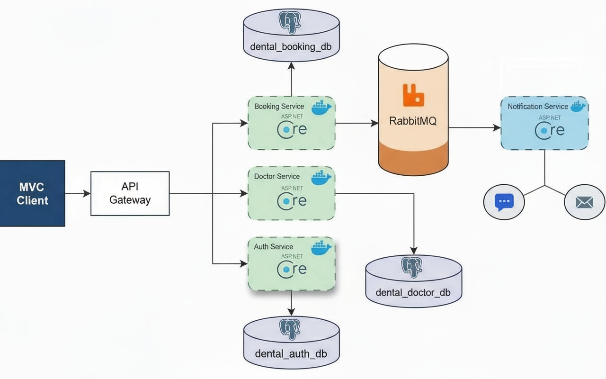

---

## 📸 Screenshots

### Client Area

#### Login
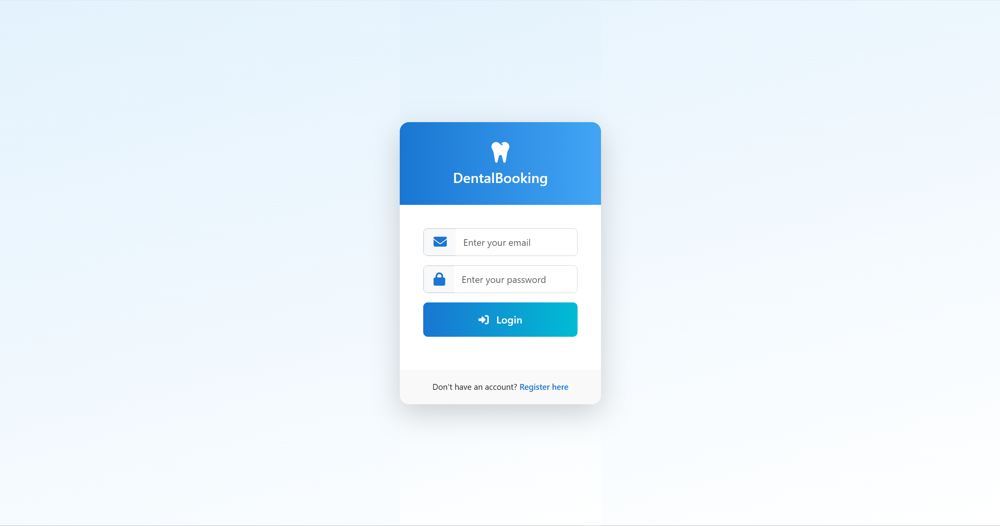

#### Register
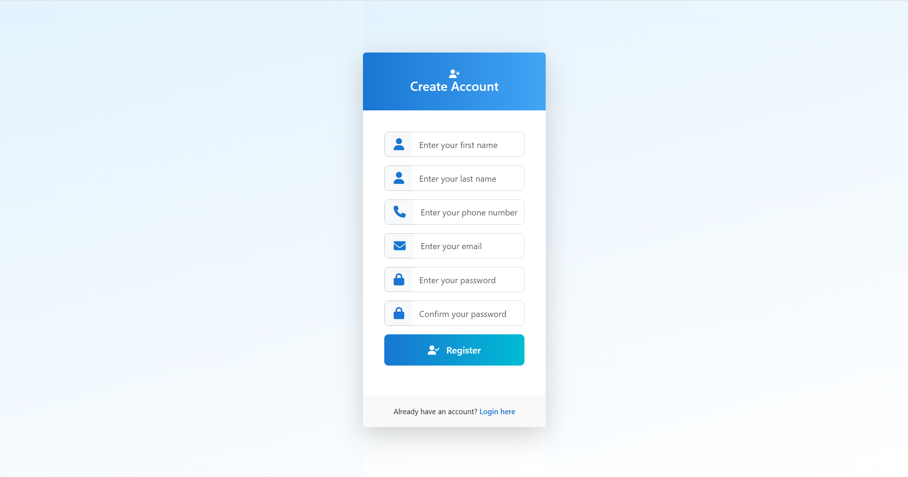

#### Booking
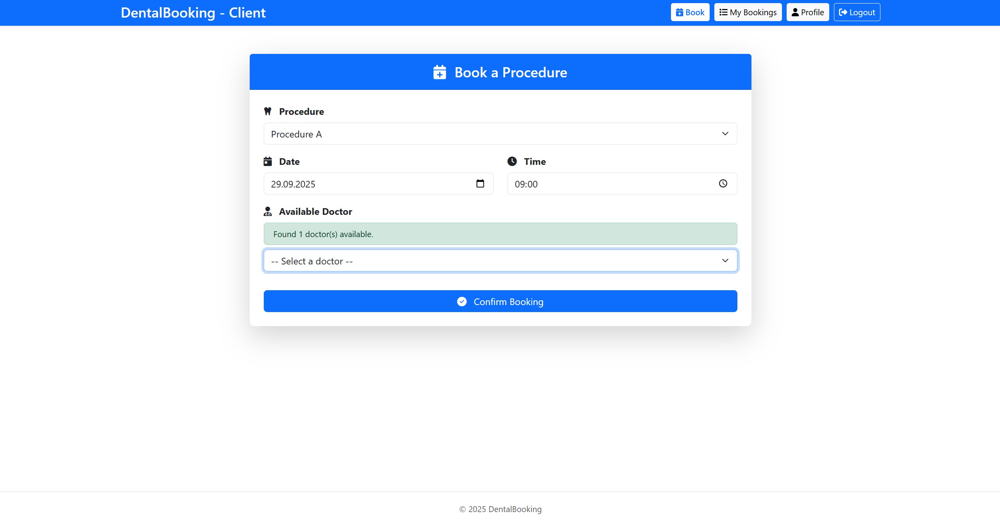

#### My Bookings
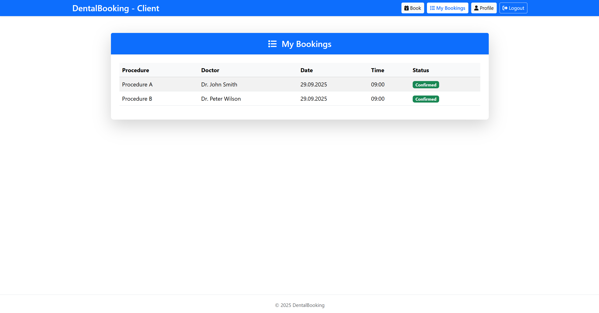

#### Profile
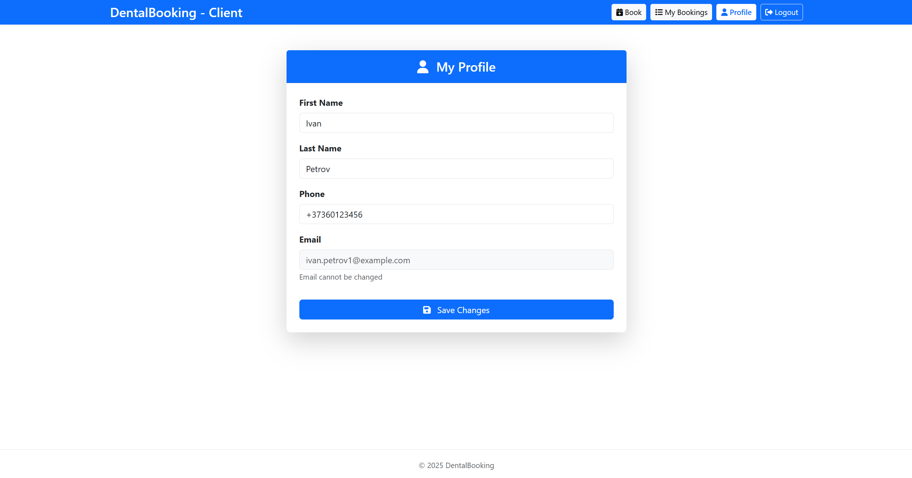

---

### Admin Area

#### Reports
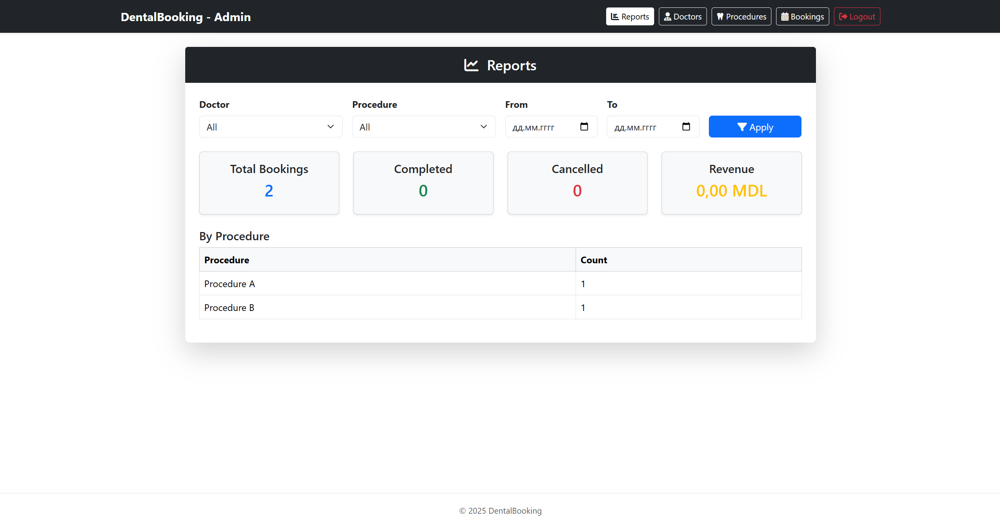

#### Doctors
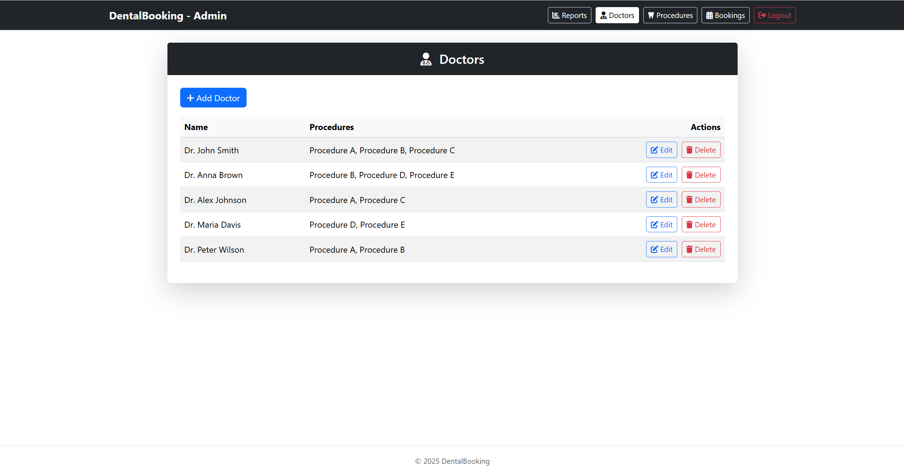

#### Procedures
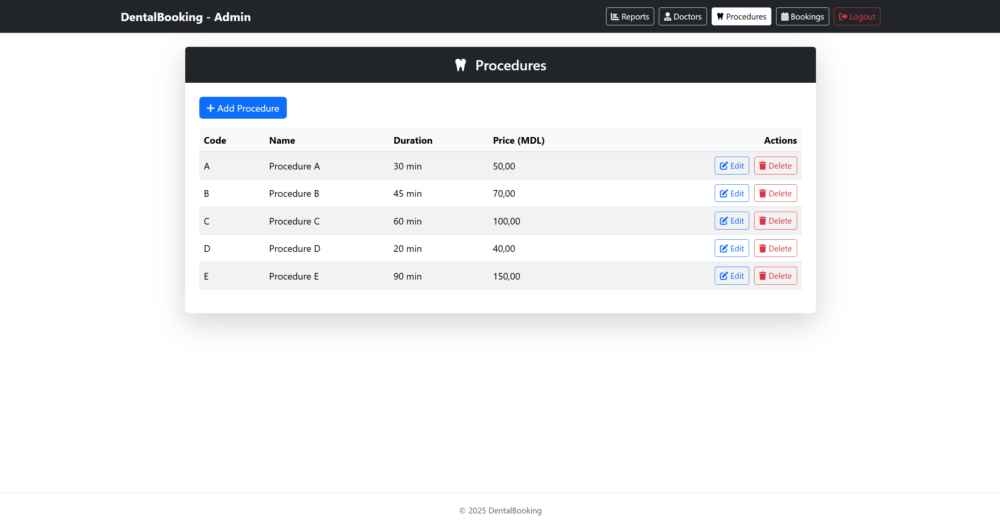

#### Bookings
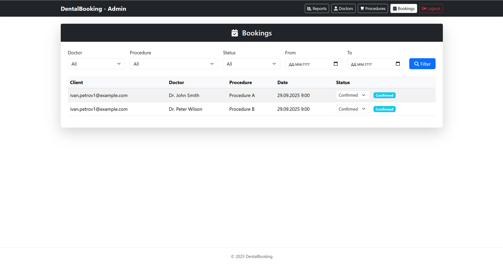

---

### Load Testing

#### Monolith
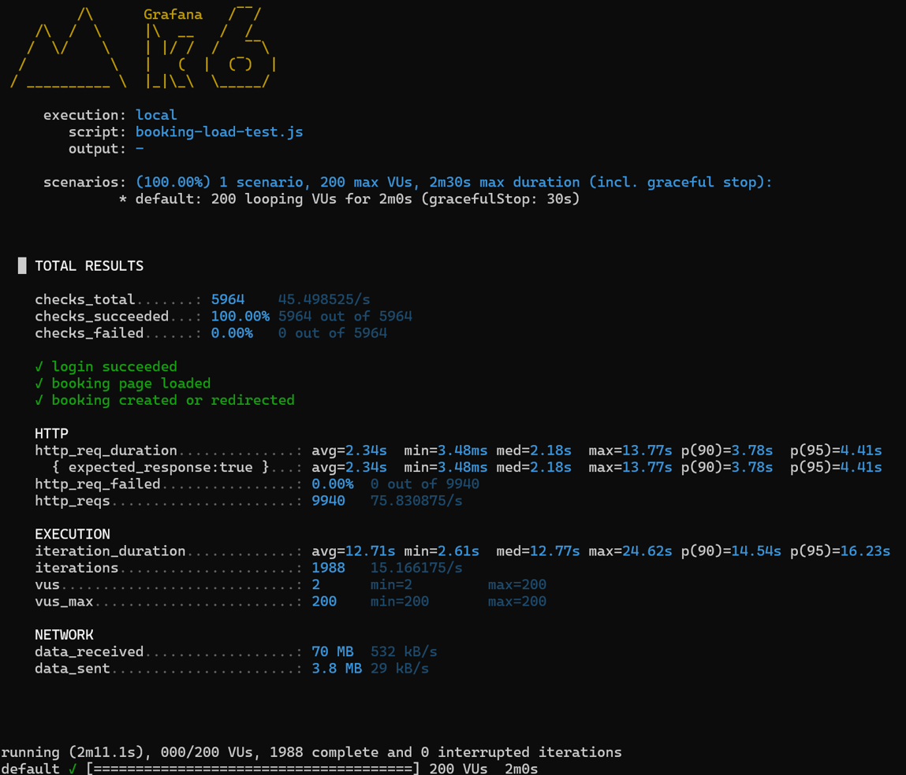

#### Microservices
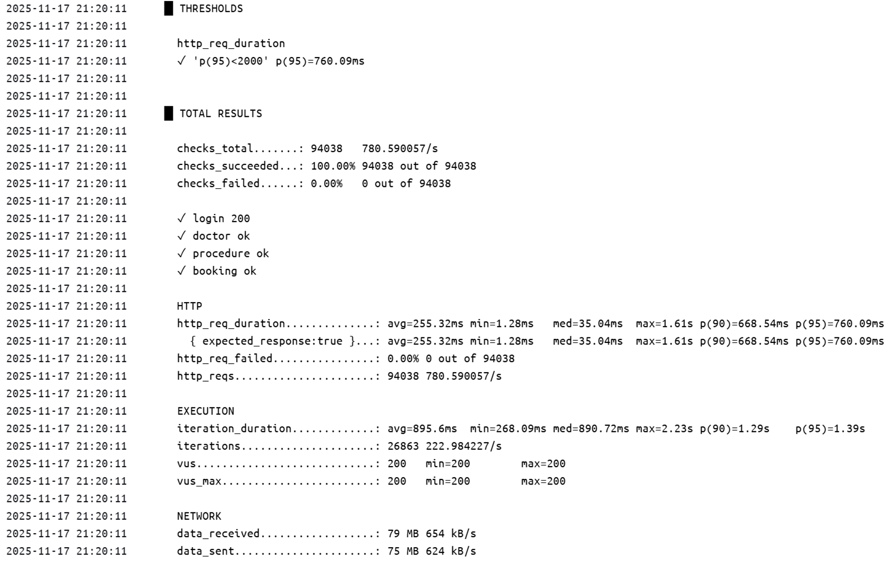

#### Grafana Dashboard
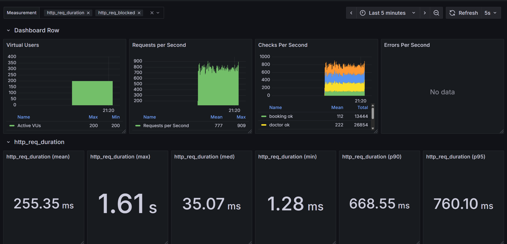


